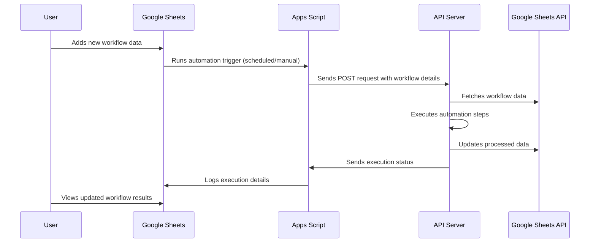

# Google Sheets Workflow Automation

A Python-based automation tool that reads and processes data from Google Sheets, executing sequential operations in a workflow.

## Overview

This project automates workflow processes by:
- Reading data from Google Sheets.
- Processing the data sequentially.
- Executing operations based on a workflow defined in the spreadsheet.
- Storing execution results back in Google Sheets.

## How It Works



## Prerequisites

- Python **3.7 or higher**
- A **Google Cloud Platform** account
- **Google Sheets API** enabled
- **Service account key** (for authentication)
- **direnv** (optional, for environment variable management)

## Installation

### 1. Clone the Repository

```bash
git clone git@github.com:nadeemcite/automotive.git
cd automotive
```

### 2. Install `direnv` (Optional but Recommended)

`direnv` helps manage environment variables automatically. To install and allow it:

```bash
# Install direnv (Linux/macOS)
brew install direnv  # macOS (Homebrew)
sudo apt install direnv  # Debian/Ubuntu

# Enable direnv for the current project
echo "eval \"\$(direnv hook bash)\"" >> ~/.bashrc  # For Bash
echo "eval \"\$(direnv hook zsh)\"" >> ~/.zshrc    # For Zsh
source ~/.bashrc  # or source ~/.zshrc

# Allow direnv in the project folder
direnv allow
```

### 3. Install Python and Create a Virtual Environment

```bash
python3 -m venv .venv
source .venv/bin/activate  # On macOS/Linux
# OR
.venv\Scripts\activate  # On Windows (PowerShell)
```

### 4. Install Required Dependencies

```bash
pip install -r requirements.txt
```

## Google Sheets API Setup

1. **Enable the Google Sheets API:**
   - Go to the [Google Cloud Console](https://console.cloud.google.com/).
   - Create a new project or select an existing one.
   - Enable the **Google Sheets API**.
   - Create a **service account** and generate a **JSON key file**.
   - Rename the file to **`credentials.json`** and place it in the project root.

2. **Share Your Google Sheet with the Service Account**
   - Open your Google Sheet.
   - Click **Share** and add the service account email (from `credentials.json`) with **Editor** access.

3. **Set the `SPREADSHEET_ID`**
   - Copy the spreadsheet ID from the URL of your Google Sheet.
   - Update your configuration file or environment variables.

## Deployment

### 1. Deploy API Server on Vercel

- Install Vercel CLI and deploy:
  ```bash
  npm install -g vercel
  vercel
  ```
- Retrieve the deployed **API URL**.

### 2. Add Google Apps Script

1. **Open Google Sheets → Extensions → Apps Script.**
2. **Paste the following script:**
   ```javascript
   const SHEET_URL = "YOUR_GOOGLE_SHEET_URL";
   const VERCEL_LINK = "YOUR_DEPLOYED_API_URL";

   function runScript() {
       const worksheet = SpreadsheetApp.openByUrl(SHEET_URL);
       const sheet = worksheet.getSheetByName('MASTER');
       const rows = sheet.getDataRange().getValues();

       for (let i = 1; i < rows.length; i++) {
           const variableSheetId = rows[i][1].toLocaleString('fullwide', { useGrouping: false });
           const reqArray = [variableSheetId, ...rows[i].slice(2)];
           const url = VERCEL_LINK;
           Logger.info(reqArray);

           const options = {
               "method": "post",
               "headers": {
                   "Content-Type": "application/x-www-form-urlencoded"
               },
               "payload": {
                   "data": JSON.stringify(reqArray)
               },
               "muteHttpExceptions": true
           };

           const response = UrlFetchApp.fetch(url, options);
           Logger.info(response);
       }
   }
   ```

3. **Replace:**
   - `YOUR_GOOGLE_SHEET_URL` with your **Google Sheets link**.
   - `YOUR_DEPLOYED_API_URL` with the **Vercel API URL**.

### 3. Schedule the Script (Trigger Automation Periodically)
1. Go to **Apps Script Editor** → Click on **Triggers (⏰ Icon)**.
2. Click **+ Add Trigger**.
3. Set up:
   - **Function:** `runScript`
   - **Event Source:** **Time-driven**
   - **Type:** **Hourly / Every X minutes**
   - **Failure Notifications:** Notify in case of failures.
4. Save the trigger.

## Usage on local

Run the automation script:

```bash
python app.py
```

Now, your **Google Sheets will automatically trigger workflow automation using the API**! 🚀
